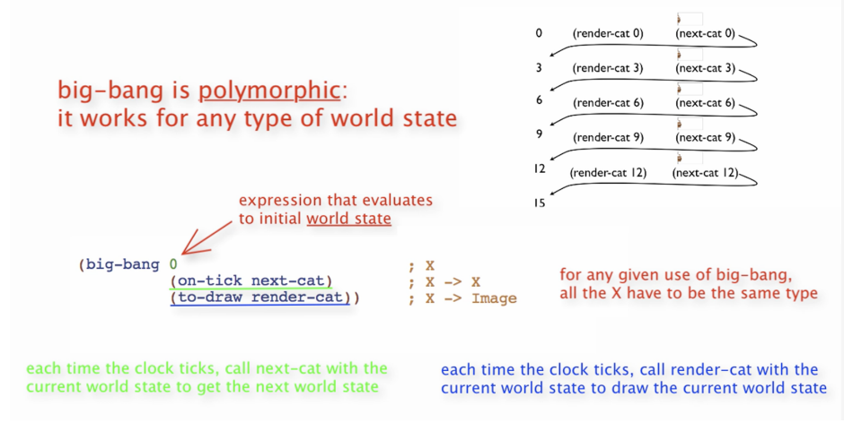
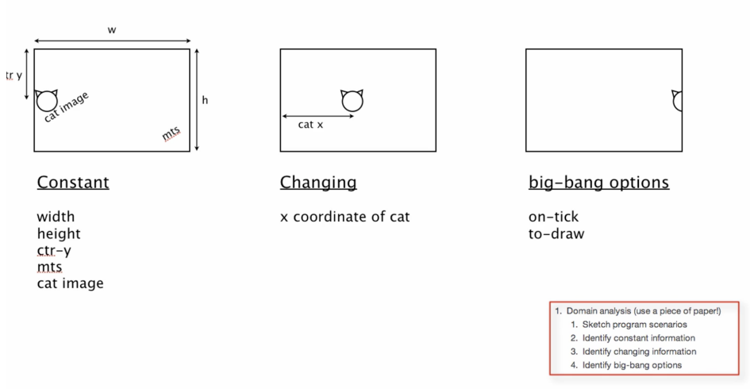

In the last blog post we talked about how to design data, which in short is thinking about the data that our program will use, how we are going to represent problem domain things with data. We went through some specific steps (HtdD recipe), that helped us have a better understanding of the data we are going to use later in our functions. 
So we have two pieces of the puzzle, how to design functions, how to design data, and now we close it all with how to design worlds.
First question would probably be, what do you mean by worlds? Which is fair, and since none of us are gods, I assume, we are talking about a small model world in a computer program. We are going to use a library called Big Bang, which will give us the tools to create interactive graphical programs. For this, we are learning the HtDW recipe to design interactive programs with atomic world state.

Interactive Programs
First thing we should ask ourselves is what entails an interactive program? Here we have three fundamentals elements:

1. Changing State
2. Changing Display
3. Events (mouse/keyboard) affects behavior

So whatever big bang does for us, it will interact with those three elements. 

But, enough chatter, let us take a look at an example to understand what we are talking about:



As we see in the example, big-bang is a function which takes as a first argument the initial world state(in this case is a number which represents the x-coordinate position of the image of a cat, hence the name “cat”. After that, we have an indefinite number of big-bang expressions, such as on-tick and to-draw, both of which have as an argument a function (a callback in JS terms). Important to mention that each of these functions receive the world state and (maybe) produce a new one.

All big-bang wants is for you to give it an initial world state. And then for on-tick, you've got to give it
a function that consumes a world state of that type and produces a world state of that type.

And then for to-draw, you have to give it a function that consumes the world state of that type, whatever it is, and produces an image.

### Domain Analysis

Now that we've covered the Big Bang mechanism, we're going to get into the how to design worlds. That's a process that lets us systematically design interactive programs, or what the big bang calls world programs.

We are going to design interactive programs. To do so we need the recipe to design worlds, which consists of two parts: Domain Analysis, for which we are going to use just pen and paper, and Building the actual program (coding).

The four steps in the Domain Analysis are:
1. Draw 2 or 3 images that reflect different states of the program.
2. Look for the constants (what doesn’t change) in those images and point them out.
3. Look for the changing information in the program.
4. Look for the identity Big Bang options, which are the way we are allowing the information change to happen.

In this course, we are using as an example a program that moves a cat image across the screen (just so the examples make sense). Here is a visual example of these steps:



All right, so we draw this on a piece of paper, now what? We start working on the program:

First things we do are import our libraries, explain what the program does and define all the constants that we previously identified in the domain analisis.

```lisp
(require 2htdp/image)
(require 2htdp/universe)

;; A cat that walks left to right across the screen.

;; =====================
;; Constants:
(define WIDTH 600)
(define HEIGHT 400)

(define CTR-Y (/ HEIGHT 2))
(define MTS (empty-scene WIDTH HEIGHT))

(define CAT-IMG .)
```
There we also see some big-bang specific syntax such as the use of empty-scene which is going to build the screen where the program is going to be visible.

Once that is settled, we start with an old friend: Data definitions. We know that what is going to be changing, the state of our program is the x coordinate, the x coordinate is clearly a number, and we are calling it cat. So we quickly use the HtDD recipe and end up with this:

```lisp
;; =====================
;; Data Definitions:

;; Cat is Number
;; interp. x position of the cat in screen coordinates
(define C1 0)           ; left edge
(define C2 (/ WIDTH 2)) ; middle
(define C3 WIDTH)       ; right edge

#;
(define (fn-for-cat c)
  (... c))

;; Template rules used:
;; atomic non-distinct: Number
```
Great, so we have our constants ready, the data that we are going to use, and we are missing just one thing: Our functions. For this case we have two stages, the first is the one where we write the big bang, specifics, and later, where we write all the functions that are going to be called by big bang. So here is the first part:

```lisp
;; =====================
;; Functions:

;; Cat -> Cat
;; start the world with (main 0)
 (define (main c)
  (big-bang c              ; Cat
    (on-tick advance-cat)  ; Cat -> Cat
    (to-draw render)))     ; Cat -> Image
```

We can see that we run the project using main 0, 0 being the initial world state we pass, but we could pass any number really.  Then we see the big bang function which takes that value, and pipes it down until t-draw, which renders the new state. We also see that on-tick calls advance-cat, and to-draw calls render, but we don’t know what those functions are. So let us take a look:

```lisp
;; Cat -> Cat
;; produce the next cat, by advancing one pixel to the right

(check-expect (advance-cat 1) 2)

;; (define (advance-cat c) 0) ; stub
;; <use template from CAT>

(define (advance-cat c)
  (+ c 1))

;; Cat -> Image
;; render the cat image at appropriate place on MTS
(check-expect (render 4) (place-image CAT-IMG 4 CTR-Y MTS))

;; (define (render c) MTS) ; stub
;; <use template from CAT>

(define (render c)
  (place-image CAT-IMG c CTR-Y MTS))
```
As we can see, both functions use the world state as a parameter, it is big-bang who calls those functions passing it the appropriate value (and later passing the updated state as an argument and doing so recursively).

So that’s about it in general terms, want to look at the program all together? No problem, here it is:

```lisp
(require 2htdp/image)
(require 2htdp/universe)

;; A cat that walks left to right across the screen.

;; =====================
;; Constants:
(define WIDTH 600)
(define HEIGHT 400)

(define CTR-Y (/ HEIGHT 2))
(define MTS (empty-scene WIDTH HEIGHT))

(define CAT-IMG .)

;; =====================
;; Data Definitions:

;; Cat is Number
;; interp. x position of the cat in screen coordinates
(define C1 0)           ; left edge
(define C2 (/ WIDTH 2)) ; middle
(define C3 WIDTH)       ; right edge

#;
(define (fn-for-cat c)
  (... c))

;; Template rules used:
;; atomic non-distinct: Number


;; =====================
;; Functions:

;; Cat -> Cat
;; start the world with (main 0)
 (define (main c)
  (big-bang c              ; Cat
    (on-tick advance-cat)  ; Cat -> Cat
    (to-draw render)))     ; Cat -> Image

;; Cat -> Cat
;; produce the next cat, by advancing one pixel to the right

(check-expect (advance-cat 1) 2)

;; (define (advance-cat c) 0) ; stub
;; <use template from CAT>

(define (advance-cat c)
  (+ c 1))

;; Cat -> Image
;; render the cat image at appropriate place on MTS
(check-expect (render 4) (place-image CAT-IMG 4 CTR-Y MTS))

;; (define (render c) MTS) ; stub
;; <use template from CAT>

(define (render c)
  (place-image CAT-IMG c CTR-Y MTS))
```

### Adding some interactivity

It is important to understand that with big-bang we can also add interactions on our program. We can use, for instance, key events to listen for a particular event and run some code in case the event matches what we want. As an example, here is from a countdown program:

```lisp
(define (handle-key cd ke)
  (cond [(key=? ke " ") 10]
        [else cd]))
```

And how it looks on the big-bang function:

```lisp
(define (main cd)
  (big-bang cd
            (on-tick advance-countdown 1)   ; Countdown -> Countdown
            (to-draw render-countdown)      ; Countdown -> Image
            (on-key handle-key)))           ; Countdown KeyEvent -> Countdown
```

handle-key as all other functions, takes cd (which is the countdown state) and an event (ke). If the key event fired was a space-bar, then the returned world state is 10 (so we are resetting it), else, it keeps the world state that the function received.

In this way, we can add interactivity to the program by receiving the world state and modifying it based on our conditions.

### A word concerning Templates

Before we finish, I want to mention some words regarding templating (which is done a lot in this course) and even though it looks weird, it is something that can be quite useful.

So data-driven templates are saying, given that I know what type of data this function consumes, what do I know about the structure of this function? And the Big Bang World program template is a way of saying that given that I know I'm using Big Bang, what do I know about the basic structure of this program before I start?

As professor Gregor Kiczales states, “templates are an idea that you can use throughout your career, no matter how sophisticated a programmer you get to be. When you get a hard problem and you don't quite know how to do it, you first say, well, what do I know about the basic structure of the program before I get to the details? That's an incredibly powerful idea. And it's not one that's just for beginners”.

Alright, that was quite long. Next is how we define and work with compound data in Dr. Racket (and why we would like to). Until next time!


