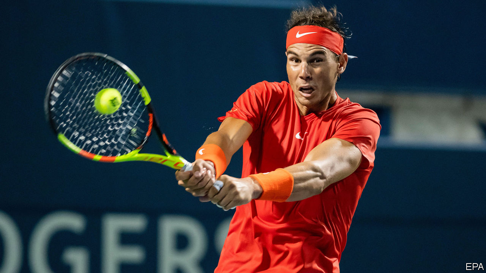
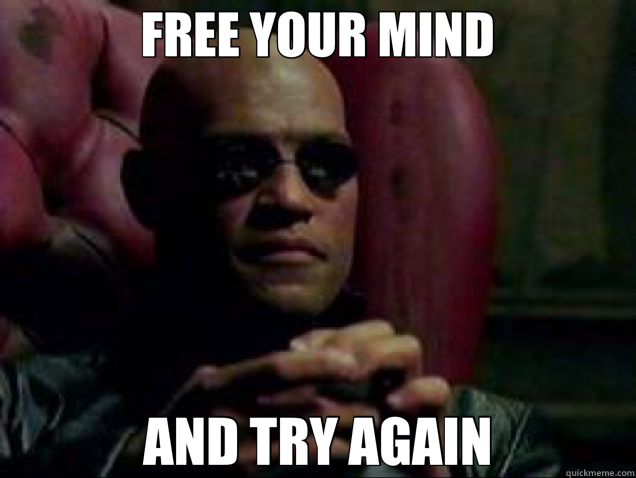

As I previously stated, refactoring is the art of changing existing -working- code, and make it better without altering its external behaviors. As a Kata yesterday, Preetham and I worked on [this](https://github.com/emilybache/Tennis-Refactoring-Kata/blob/master/javascript/TennisGame1.js) source code, that is basically an app to keep track of tennis scores, but is written purposely bad (or not ideally) so you can refactor it. The awesome thing is that the code comes with a very exhaustive amount of tests, so you can refactor and check constantly whether you broke something or not.

Since we didn't work on my computer, today I decided to start from scratch (very much in the fashion of Code Retreat) and refactor during the Kata. I will share what I managed to do and why, but first, let me unload to you a BIG amount of code.


```javascript
TennisGame1.prototype.getScore = function () {
  var score = ""
  var tempScore = 0
  if (this.m_score1 === this.m_score2) {
    switch (this.m_score1) {
      case 0:
        score = "Love-All"
        break
      case 1:
        score = "Fifteen-All"
        break
      case 2:
        score = "Thirty-All"
        break
      default:
        score = "Deuce"
        break
    }
  } else if (this.m_score1 >= 4 || this.m_score2 >= 4) {
    var minusResult = this.m_score1 - this.m_score2
    if (minusResult === 1) score = "Advantage player1"
    else if (minusResult === -1) score = "Advantage player2"
    else if (minusResult >= 2) score = "Win for player1"
    else score = "Win for player2"
  } else {
    for (var i = 1; i < 3; i++) {
      if (i === 1) tempScore = this.m_score1
      else {
        score += "-"
        tempScore = this.m_score2
      }
      switch (tempScore) {
        case 0:
          score += "Love"
          break
        case 1:
          score += "Fifteen"
          break
        case 2:
          score += "Thirty"
          break
        case 3:
          score += "Forty"
          break
      }
    }
  }
  return score
}
```

As Jacek told us, focus first on the **bottleneck** when refactoring, what is urgent. As the size of the method was huge, and did a lot of different things, that was a good starting point.

First things we noticed was the readability of the conditions, it would be great to extract what is that you are looking for, for example: `this.scorePlayer1 === this.scorePlayer2`. What you are really asking is if there is a draw, so we can store that in "isDraw". If that condition is true, you proceed to do a series of actions. What is the aim of those actions? Well, to get the scores in a drawing situation. So `"shift-command-J-M"` and extract that functionality into it's own... well... function, and call it inside the main function.

Talking about this is a bit abstract without code, so here is the result:

```javascript
TennisGame1.prototype.getDrawScore = function () {
  switch (this.scorePlayer1) {
    case 0:
      score = "Love-All"
      break
    case 1:
      score = "Fifteen-All"
      break
    case 2:
      score = "Thirty-All"
      break
    default:
      score = "Deuce"
      break
  }
  return score
}

TennisGame1.prototype.getWinningSituationScore = function () {
  const minusResult = this.scorePlayer1 - this.scorePlayer2
  if (minusResult === 1) {
    score = "Advantage player1"
  } else if (minusResult === -1) {
    score = "Advantage player2"
  } else if (minusResult >= 2) {
    score = "Win for player1"
  } else {
    score = "Win for player2"
  }
  return score
}

TennisGame1.prototype.getPlayerScore = function (currentPlayer) {
  const tempScore = currentPlayer
  let playerScore
  switch (tempScore) {
    case 0:
      playerScore = "Love"
      break
    case 1:
      playerScore = "Fifteen"
      break
    case 2:
      playerScore = "Thirty"
      break
    case 3:
      playerScore = "Forty"
      break
  }
  return playerScore
}

TennisGame1.prototype.getMidGameScore = function () {
  const player1Score = this.getPlayerScore(this.scorePlayer1)
  const player2Score = this.getPlayerScore(this.scorePlayer2)
  return `${player1Score}-${player2Score}`
}

TennisGame1.prototype.getScore = function () {
  let score = ""
  const isDraw = this.scorePlayer1 === this.scorePlayer2
  const isWinningSituation = this.scorePlayer1 >= 4 || this.scorePlayer2 >= 4
  if (isDraw) {
    score = this.getDrawScore()
  } else if (isWinningSituation) {
    score = this.getWinningSituationScore()
  } else {
    score = this.getMidGameScore()
  }
  return score
}
```



### Conclusion Time

The code is far from perfect or finished, that was not the intention, but just to make it better during the kata. If you see, the main body is much more readable: `isDraw`? then `getDrawScore` and assign it to `score`. `isWinningSituation`? then `getWinningSituation` and assign it to `score`. If none of the above is the case, `getMidGameScore` and assign it to `score`.

This exercise was really interesting, besides practicing with keyboard shortcuts of my IDE to do operations like _variable and method extraction, rename variables,_ and others, it showed me the value of having robust unit tests. You can make small changes, test, and continue without being scared (for example I found a variable I wasn't sure was doing anything, so I erased it, ran the tests, and everything remained green, meaning it was a good choice. Without tests, probably would have been scared to break something I'm not aware of).
